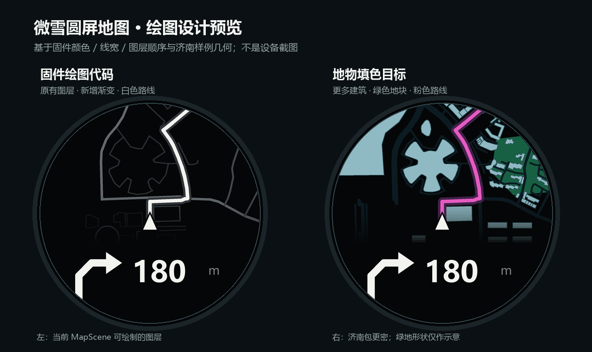

# 微雪圆屏绘图设计与预览

左图重现**现有固件图层，加上本轮新增的底部渐变**；右图是地物填色的目标视觉方案，不是固件截图或已经从百度取得的地图数据。左图道路和建筑轮廓来自仓库自带的济南 `MapScene` 样例；右图为了观察更密集的效果，读取同一仓库的济南离线地图包内更多道路和建筑。两边路线来自济南导航样例。右图的绿色多边形是示意形状，不能当作真实公园或草地。

## 从现有代码提取的规则

| 元素 | 现有实现 | 来源 |
| --- | --- | --- |
| 圆屏 | 466 × 466 像素，设计尺寸 360；界面按比例缩放 | `shared/nav_ui/include/moto_nav_ui.h`、`moto_nav_ui.cpp` 的 `px` |
| 地图视窗 | 顶部 `px(232)` 高，车头固定在设计坐标 `(180,196)`；地图随方向旋转 | `moto_nav_ui.cpp::create_navigation_page`、`shared/nav_presenter/src/moto_nav_presenter.cpp::project_map_point` |
| 周边道路 | 每条独立折线；主干道、普通路、服务路分别用 4、3、2 设计像素的灰线 | `moto_nav_ui.cpp::update_road_geometry` |
| 建筑 | 最多 16 个真实建筑轮廓；当前只有闭合描边，未填色 | `moto_nav_ui.cpp::apply_building_geometry_frame` |
| 上下衔接 | 道路与建筑在地图下缘通过 24 级透明度渐隐；路线与车头仍在渐变之上 | `moto_nav_ui.cpp::draw_map_fade` |
| 路线 | 石墨色 13 像素底线，再画白色 6 像素主线；盖在道路之上 | `moto_nav_ui.cpp::create_navigation_page` |
| 车头和转弯 | 固定三角车头；下半屏绘制转弯图标、距离和进度弧 | `moto_nav_ui.cpp::draw_vehicle_marker`、`draw_maneuver_icon` |
| 配色 | 黑、灰、白、冰蓝、琥珀色保存在共用样式头文件 | `shared/nav_ui/include/moto_map_visual_style.h` |

绘图顺序是**建筑轮廓 → 道路 → 地图渐变 → 路线阴影 → 路线 → 车头 → 导航信息**。路线和周边道路都用同一个地理投影：以骑手坐标为原点，转换为东/北向米数，按照车头朝向旋转，再投到圆屏上。手机预览虽然使用共用配色绘制路线，百度底图的道路与地物仍由百度 SDK 自己绘制。

## 下一步要补的能力

图中用户要求的蓝色建筑块与绿色草地块需要带类别和边界坐标的闭合面。现有协议只有道路和建筑轮廓，没有绿地/水体，也没有建筑填充；设备现有上限是 24 条道路、192 个道路点、16 栋建筑、128 个建筑点，因此右图的密度超出当前设备消息容量。取得合规面要素来源后，须设计按视窗优先级裁剪和简化的传输方案，再扩展数据模型与 LVGL 绘制。固件渐变的起点、高度和分级数现在位于共用样式头文件；目标色块和路线颜色位于预览脚本的 `CONCEPT_*` 常量，日后可直接换风格。

预览可用 `python scripts/preview/render_waveshare_map.py` 重建。该脚本读取上述固件样式、济南样例和路线，并按照固件的比例、朝向投影和图层顺序绘图。它使用 Pillow；结果是设计验证图，不是 LVGL 真机像素截图。
